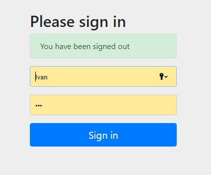

###  Задача «Безопасное приложение»

Описание

- ограничте доступ к endpoint.
- Возьмите любое ваше реализованных приложений на Spring Boot, где есть 
  контроллер и не менее одного метода-обработчика запросов на разные endpoint.
- Добавьте в приложение зависимость на spring-boot-starter-security.
- Реализуйте класс-наследник WebSecurityConfigurerAdapter или  так, чтобы:
пользователь логинился через стандартную форму логина от Spring;
как минимум на один из endpoint вашего приложения можно было попасть без 
авторизации, а на все остальные — только после авторизации.

### Описание

#### Для запуска проекта необходимо:

1. Запустить файл docker-compouse.yaml в  Docker Desktop
   
 - version: '3.9'
- services:
  - postgres:
    - image: postgres:latest
    - restart: always
    - environment:
     -  POSTGRES_DB: 'mrx_db'
      - POSTGRES_USER: 'mrx'
      - POSTGRES_PASSWORD: '123'
    - ports:
      - '5432:5432'
    - volumes:
      - ./init.sql:/docker-entrypoint-initdb.d/init.sql
  
2. в приложении  DBeaver  
- создать новое соединение PostgreSQL  mrx_db
- создать shema командой : create schema migration;

3. запустить приложение  классе HibernateExampleApplication
4. База Данных заполниться автоматически
5. в браузере ввести : localhost:8080/persons/by-city?city=Moscow
  -  в окне ввести логин: Ivan  пароль: 777 (ADMIN) доступны все методы
  -  или ввести Oly:123 (USER) доступно : localhost:8080/persons/by-name-surname?name=Ivan&surname=Ivanov
  
